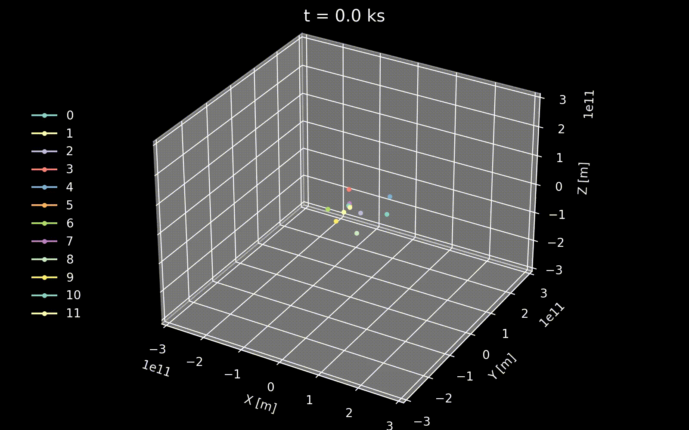

# planets
### A Newtonian N-body simulation 


To start the simulation, run

```
python3 run.py
```

Add an object to the list by entering its name, mass and the state vectors (position and velocity). Alternatively, one can enter the Keplerian orbital elements and convert them into the state vectors. The orbital parameters of the eight planets (plus Pluto and two comets) in the Solar System (epoch = 2451545.0 (2000-Jan-1.5)) are saved in the ```parameters``` folder and can be loaded into the program. Once all the objects are entered, set the duration (days) and time resolution (steps per day) of the simulation before starting the run. A time resolution of 10 steps per day should give reasonable accuracy in most cases. The program automatically saves the simulation snapshots in the ```results``` folder. To calculate the orbital elements (_e_, _a_, _i_, $\Omega$, $\bar{\omega}$, _L_) or (_e_, _a_, _i_, $\Omega$, $\omega$, _M_) of a particular object at the end of the simulation, run

```
python3 kepler.py simulation_output object_name central_body_name
```

The final state of the simulation run is plotted and can be found in ```results/plots```. To create videos from the snapshots, run

```
python3 visualization.py simulation_output plot_range_in_m colormap kepler_overlay
```

This will generate videos of the simulation in ```results/videos``` with the specified plot range (in meters) and color map. If the parameter ```kepler_overlay``` is set to 1, the Keplerian orbits specified by the initial orbital elements will be plotted in dashed lines alongside the actual orbits.


In addition, there is the option to generate a number of objects with random masses, positions and velocities within a specified radius, which can then be added to the system:


